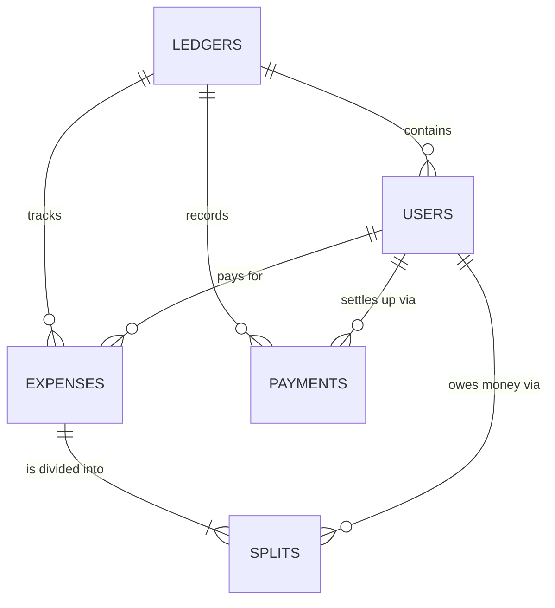

ERD:

## Table Field Specifications

### Table: `ledgers`

The "Global Registry" for all Potluck groups. Every row represents a unique event or trip.

- **Purpose:** Acts as a secure, isolated container.
- **Key Logic:** The `id` (UUID) is the secret key in the URL. If a user has the link, they have access to this specific ledger's data.

| Field | Type | Attributes | Description |
| :--- | :--- | :--- | :--- |
| `id` | UUID | PK, Default: gen_random_uuid() | Unique identifier for the group. |
| `title` | TEXT | NOT NULL | Display name (e.g., "Japan 2026"). |
| `base_currency` | TEXT | Default: 'CAD' | The currency used for the final settlement. |
| `emoji` | TEXT | Optional | Emoji chosen by the organizer to represent the group. |
| `simplify_debts` | BOOLEAN | NOT NULL, Default: true | Whether the Balances tab collapses debts into the fewest possible transfers. It belongs to the ledger rather than to a viewer, so toggling it changes the view for everyone in the group; other viewers pick the change up on their next load. |
| `created_at` | TIMESTAMPTZ | Default: NOW() | Timestamp for audit/sorting. |

### Table: `users`

Stores every person associated with a specific ledger.

- **Purpose:** Tracks who is involved in a ledger.
- **Key Logic:** Every user row is created as a "Placeholder" today — an organizer (or any participant) adds a name via the "Manage Users" flow. There is currently no join/claim flow; the fields below that were scaffolded for that are unused by the app for now.

| Field | Type | Attributes | Description |
| :--- | :--- | :--- | :--- |
| `id` | UUID | PK, Default: gen_random_uuid() | Unique identifier for the participant. |
| `ledger_id` | UUID | FK -> ledgers.id | Links the user to a specific group. |
| `name` | TEXT | NOT NULL | Display name for the user. |
| `is_placeholder`| BOOLEAN | Default: true | **Reserved for a future feature.** Every row is currently created with this set to `true`; no code path ever flips it, since claiming isn't implemented yet. |
| `device_token` | TEXT | Optional | **Reserved for a future feature.** Intended to store a local browser ID for account-less entry; not currently read or written anywhere in the app. |
| `phone_number` | TEXT | Optional | **Reserved for a future feature.** Present in the live schema, ahead of any app code that uses it — likely prep for phone-based claiming/2FA (see PRD 5.1). |
| `auth_user_id` | UUID | Optional | **Reserved for a future feature.** Present in the live schema, ahead of any app code that uses it. |
| `created_at` | TIMESTAMPTZ | Default: NOW() | Timestamp for audit trail. |

### Table: `expenses`

Records the act of spending money.

- **Purpose:** Documents the "Disbursement"—who fronted the cash for the group.
- **Key Logic:** Stores the `amount_cents` as an **Integer** to prevent rounding errors.

| Field | Type | Attributes | Description |
| :--- | :--- | :--- | :--- |
| `id` | UUID | PK, Default: gen_random_uuid() | Unique identifier for the expense. |
| `ledger_id` | UUID | FK -> ledgers.id | Group this expense belongs to. |
| `payer_id` | UUID | FK -> users.id | The user who fronted the cash. |
| `description` | TEXT | NOT NULL | Note (e.g., "Dinner at 7-Eleven"). |
| `amount_cents` | BIGINT | NOT NULL | Total cost in cents (auditing accuracy). |
| `original_currency`| TEXT | Default: 'CAD' | Currency used at point of sale. |
| `created_at` | TIMESTAMPTZ | Default: NOW() | Doubles as the expense's transaction date/time. It is user-editable at entry (defaults to "now," but can be backdated) and drives the chronological ordering of the expense list — whatever date/time the user picks is where the expense appears in the list. |

### Table: `splits`

The most granular table. It breaks down an expense into individual debts.

- **Purpose:** Resolves the Many-to-Many relationship between Expenses and Users.
- **Key Logic:** Every expense has multiple split rows. The sum of `amount_cents` in this table must always equal the `amount_cents` in the `expenses` table to ensure the books balance.

| Field | Type | Attributes | Description |
| :--- | :--- | :--- | :--- |
| `id` | UUID | PK, Default: gen_random_uuid() | Unique identifier for the split line. |
| `expense_id` | UUID | FK -> expenses.id | Parent transaction. |
| `user_id` | UUID | FK -> users.id | Person who owes a portion. |
| `amount_cents` | BIGINT | NOT NULL | Individual portion of the debt in cents. |

### Table: `payments`

Records money actually changing hands between two members, as opposed to a cost
being shared out.

- **Purpose:** lets a debt be closed out rather than sitting in Balances forever.
- **Key Logic:** arithmetically a payment is an expense paid by the payer whose
  entire split lands on the payee — it credits the payer and debits the payee by
  the same amount. It is stored separately so the balance math never depends on
  a synthetic `splits` row that does not mean what a split means. See
  [payments-design.md](./payments-design.md).

| Field | Type | Attributes | Description |
| :--- | :--- | :--- | :--- |
| `id` | UUID | PK, Default: gen_random_uuid() | Unique identifier for the payment. |
| `ledger_id` | UUID | FK -> ledgers.id, ON DELETE CASCADE | Group this settlement belongs to. Held directly on the row (unlike `splits`) so Realtime can filter payments per ledger. |
| `payer_id` | UUID | FK -> users.id, NOT NULL | The member who handed money over. |
| `payee_id` | UUID | FK -> users.id, NOT NULL | The member who received it. |
| `amount_cents` | BIGINT | NOT NULL, CHECK (> 0) | Amount settled, in cents. Base currency only for now — see KNOWN-ISSUES 1.4. |
| `original_currency`| TEXT | NOT NULL, Default: 'CAD' | Present for symmetry with `expenses`; v1 only writes the ledger's base currency. |
| `note` | TEXT | Optional | Free-text note. Genuinely nullable, unlike `expenses.description`. |
| `created_at` | TIMESTAMPTZ | NOT NULL, Default: NOW() | When the payment happened. Drives ordering in the Activity list. |

A `payer_id <> payee_id` check constraint prevents paying yourself.

## Row Level Security

RLS is enabled on all five tables. Access is deliberately open — the ledger's
UUID in the URL is the only secret — but **a missing policy is invisible from
the app**: Postgres filters the rows out and PostgREST still answers `200` with
an empty body, so a write that touched nothing is indistinguishable from one
that succeeded. Every operation the app performs therefore needs a matching
policy here.

| Table | SELECT | INSERT | UPDATE | DELETE |
| :--- | :---: | :---: | :---: | :---: |
| `ledgers` | ✅ | ✅ | ✅ | — |
| `users` | ✅ | ✅ | — | — |
| `expenses` | ✅ | ✅ | ✅ | ✅ |
| `splits` | ✅ | ✅ | — | ✅ |
| `payments` | ✅ | ✅ | ✅ | ✅ |

The app updates three tables in place: `expenses` (editing an expense's payer,
amount, description, currency or date), `ledgers` (the shared `simplify_debts`
toggle) and `payments` (editing a settlement, planned for a later phase — the
policy is in place ahead of it). `splits` has no UPDATE policy because editing an
expense rewrites its splits as a DELETE followed by an INSERT rather than
updating them.
