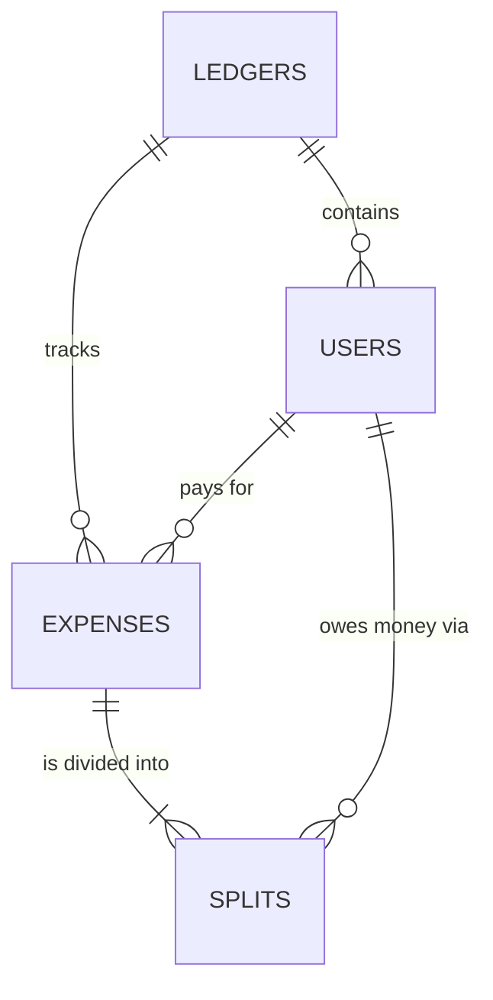

ERD:

Table definitions:
### `ledgers` (The Project Header)

The "Global Registry" for all Potluck groups. Every row represents a unique event or trip.

- **Purpose:** Acts as a secure, isolated container.
    
- **Key Logic:** The `id` (UUID) is the secret key in the URL. If a user has the link, they have access to this specific ledger's data.
    

### `users` (The Participants)

Stores every person associated with a specific ledger.

- **Purpose:** Tracks who is involved and their "claim" status.
    
- **Key Logic:** Supports "Placeholders" (`is_placeholder`). An organizer can add a name before the person actually joins the digital group.
    

### `expenses` (The Transaction Head)

Records the act of spending money.

- **Purpose:** Documents the "Disbursement"—who fronted the cash for the group.
    
- **Key Logic:** Stores the `total_amount_cents` as an **Integer** to prevent rounding errors.
    

### `splits` (The Sub-Ledger)

The most granular table. It breaks down an expense into individual debts.

- **Purpose:** Resolves the Many-to-Many relationship between Expenses and Users.
    
- **Key Logic:** Every expense has multiple split rows. The sum of `share_cents` in this table must always equal the `total_amount_cents` in the `expenses` table to ensure the books balance.

## Table Field Specifications

### Table: `ledgers`
| Field | Type | Attributes | Description |
| :--- | :--- | :--- | :--- |
| `id` | UUID | PK, Default: gen_random_uuid() | Unique identifier for the group. |
| `title` | TEXT | NOT NULL | Display name (e.g., "Japan 2026"). |
| `base_currency` | TEXT | Default: 'CAD' | The currency used for the final settlement. |
| `created_at` | TIMESTAMPTZ | Default: NOW() | Timestamp for audit/sorting. |

### Table: `users`
| Field | Type | Attributes | Description |
| :--- | :--- | :--- | :--- |
| `id` | UUID | PK, Default: gen_random_uuid() | Unique identifier for the participant. |
| `ledger_id` | UUID | FK -> ledgers.id | Links the user to a specific group. |
| `name` | TEXT | NOT NULL | Display name for the user. |
| `is_placeholder`| BOOLEAN | Default: true | Tracks if the user has been "claimed". |
| `device_token` | TEXT | Optional | Stores local browser ID for account-less entry. |
| `created_at` | TIMESTAMPTZ | Default: NOW() | Timestamp for audit trail. |

### Table: `expenses`
| Field | Type | Attributes | Description |
| :--- | :--- | :--- | :--- |
| `id` | UUID | PK, Default: gen_random_uuid() | Unique identifier for the expense. |
| `ledger_id` | UUID | FK -> ledgers.id | Group this expense belongs to. |
| `payer_id` | UUID | FK -> users.id | The user who fronted the cash. |
| `description` | TEXT | NOT NULL | Note (e.g., "Dinner at 7-Eleven"). |
| `amount_cents` | BIGINT | NOT NULL | Total cost in cents (auditing accuracy). |
| `original_currency`| TEXT | Default: 'CAD' | Currency used at point of sale. |
| `created_at` | TIMESTAMPTZ | Default: NOW() | Transaction date/time. |

### Table: `splits`
| Field | Type | Attributes | Description |
| :--- | :--- | :--- | :--- |
| `id` | UUID | PK, Default: gen_random_uuid() | Unique identifier for the split line. |
| `expense_id` | UUID | FK -> expenses.id | Parent transaction. |
| `user_id` | UUID | FK -> users.id | Person who owes a portion. |
| `share_cents` | BIGINT | NOT NULL | Individual portion of the debt in cents. |
