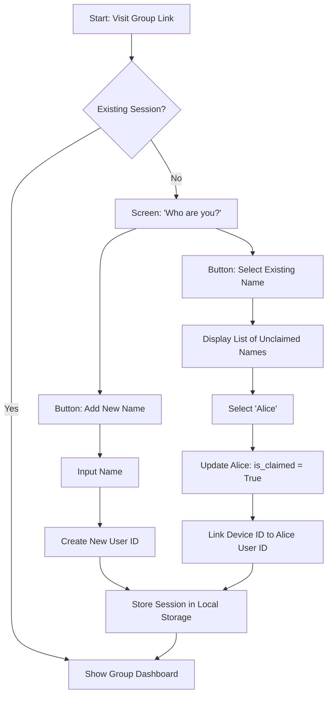

# Feature Specifications: Potluck

This document defines the logic and state transitions for complex features within the Potluck application.

---

## 1. Feature: Placeholder Profiles & "Claiming" Logic
**Problem:** In Splitwise, an organizer cannot assign an expense to someone who hasn't downloaded the app or created an account yet.
**Solution:** Allow organizers to create "Placeholder" names that represent real people. These entities can be "claimed" later by invitees.

### Logic Flow & State Transitions
1. **Creation (Organizer):** - Organizer creates a group.
   - Organizer adds names (e.g., "Alice", "Bob") without emails/phones.
   - System generates a `user_id` and sets `is_claimed: false` for each.
2. **Invitation:** - Organizer shares a unique group URL (e.g., `swiftsplit.io/g/uuid-123`).
3. **Joining (Invitee):**
   - New user visits the URL.
   - System checks Local Storage for an existing `session_token` for this group.
   - If none found, UI displays: "Who are you?" with two options:
     - **Option A:** "I am [List of Unclaimed Names]"
     - **Option B:** "I'm new (Add my name)"
4. **Claiming:**
   - If User selects "Alice," the system updates `is_claimed: true`.
   - The user’s current Browser `device_id` is linked to the `user_id` for "Alice."
   - All historical expenses previously assigned to "Alice" are now visible and editable by this user.

---

## 2. Feature: Advanced Split Logic
**Problem:** Simple 50/50 splits are insufficient for complex group dynamics (e.g., one person ordered a steak, others shared appetizers).

### Split Types
* **Equally (Default):** `Total Amount / Number of Participants`.
* **Percentage:** - Each participant is assigned a `%`.
  - **Validation:** The sum of all percentages must equal exactly `100.00%`. The "Save" button remains disabled until this condition is met.
* **Exact Amount:**
  - Each participant is assigned a specific currency value.
  - **Validation:** The sum of individual amounts must equal the `Total Transaction Amount`.
  - **Audit Note:** Use integer math (cents) to ensure no "lost pennies" occur during calculation.

### Multi-Currency Conversion
- When an expense is entered in a non-base currency (e.g., JPY), the app fetches the exchange rate at the **time of entry**.
- The "Home Currency" equivalent is stored alongside the original transaction to ensure the balance remains stable even if exchange rates fluctuate later.