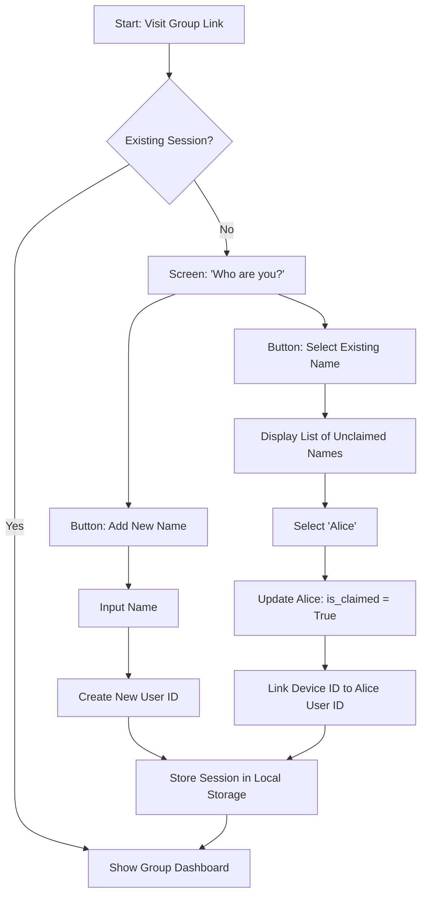

# Feature Specifications: Potluck

This document defines the logic and state transitions for complex features within the Potluck application.

---

## 1. Feature: Group Member Management (MVP)

**Problem:** In Splitwise, an organizer cannot assign an expense to someone who hasn't downloaded the app or created an account yet.
**Solution (current MVP scope):** Any participant with the group link can add a plain named member to the ledger — no email, phone number, or account required. Any member can then be selected as the payer or as a split participant on any expense.

### Logic Flow (as built)
1. **Creation:** From the ledger page, a user opens "Manage Users" and adds a name.
2. **Assignment:** That name immediately becomes selectable as a payer or split participant on any expense in the ledger — there is no separate join or activation step.
3. **No ownership/identity binding:** All members are equivalent, undifferentiated rows tied to the ledger (`is_placeholder` is always `true`). There is no concept of "this browser is Alice" — anyone with the link can add expenses on behalf of anyone in the list.

This is intentionally simple for the MVP: it covers the core use case (a small trusted group splitting costs) without needing accounts or a join flow.

### Deferred (Post-MVP): "Claiming" / Identity Binding

**Out of scope for now.** The original design explored letting invitees "claim" a placeholder name via Local Storage session binding, tying a specific browser/device to a user row so historical expenses become "theirs." This has been deprioritized in favor of other MVP-critical work (see Split Logic validation and Payments below). The schema already reserves columns for this (`device_token`, `phone_number`, `auth_user_id` — see [db-chart.md](./db-chart.md)), but no app logic uses them yet.

If/when this is revisited, the original flow was:
1. Organizer adds placeholder names (no emails/phones); each defaults to unclaimed.
2. Organizer shares the group URL.
3. A new visitor without a stored session sees "Who are you?" — pick an existing unclaimed name, or add a new one.
4. Picking an existing name "claims" it and links the visitor's device to that user, making their historical expenses visible/editable to them.

---

## 2. Feature: Split Logic

**Core Principles**
* **Integer Arithmetic:** All calculations occur in the smallest currency unit (cents) to prevent floating-point processing errors.
* **Zero-Friction Default:** New expenses default to an Equal split among all group members.

**Split Modes**

The split step offers three mutually-exclusive modes, chosen via a segmented control. Switching modes does not carry values over from another mode. All modes compute their splits once, at save time (there is no live per-field locking/auto-recalculation engine).

* **Equally:** The organizer checks/unchecks which members are included. The total is divided evenly across checked members using `Math.floor(amountCents / count)` per person, with the leftover remainder (from integer division) distributed one cent at a time to the first N members in the list, so the split always sums exactly to the total.
* **Exact Amount:** The organizer types a specific dollar amount per member. Only members with a value greater than 0 are included in the resulting split.
* **Percentage:** The organizer types a percentage per member. Each member's cents are computed as `round(total * pct / 100)`, except the last entered member, who instead absorbs whatever is left over (`total - sum of the others`) so the split sums exactly to the total.

**Allocation Validation:** Exact Amount and Percentage modes show a running allocated/remaining total (in dollars for Exact Amount, in percent for Percentage) that turns red when the entries don't add up to the expense total. The "Confirm & Save" button is disabled until Exact Amount entries sum exactly to the expense total, or Percentage entries sum to 100% (within a small rounding tolerance) — this also rules out Percentage mode's last-entry logic ever producing a negative amount, since entries can no longer overshoot 100% at save time.

## 3. Feature: Payments / Settlements

**Core Principle:** a payment is a transfer between two members — it names who
handed money over and who received it. It is not "money off what I owe": every
member's net sums to zero across the group, and crediting nobody would break
that, leaving creditors owed money the app never tells anyone to pay. See
[payments-design.md](./payments-design.md) for the full reasoning.

**Arithmetic.** A payment credits the payer and debits the payee by the same
amount, which is the same shape as an expense whose entire split lands on one
person. For the pairwise view it is an edge in the opposite direction, so the
existing mutual-cancellation step nets it off with no special casing:

* Paying part of a debt leaves the remainder.
* Overpaying reverses who is owed.
* Paying someone you owe nothing makes them your debtor.

**Recording a payment.** Two entry points:

* **Settle up**, on each row of the Transfers list. The debt on screen already
  names the payer, the payee and the amount, so the form opens filled in and
  the user only confirms. This is the intended path.
* **Add Payment**, in the floating action menu, for payments that do not match
  a suggested transfer — someone rounded up, paid early, or paid a person they
  did not owe. No amount is validated against what is currently owed, because
  all three of those are legitimate.

With Simplify Debts on, the suggested transfers are not raw pairwise debts.
Settling a simplified transfer is still correct — the arithmetic does not care
— and is the point of simplification.

**Currency.** Payments are recorded in the ledger's base currency only, until
the exchange-rate work in [KNOWN-ISSUES.md](./KNOWN-ISSUES.md) §1.4 lands.
Editing an existing payment writes back that payment's own currency rather than
the ledger's current base, so changing the base later cannot silently relabel
what was already recorded.

**History.** Payments appear in the Activity list alongside expenses, in one
chronological order, labelled "Settlement" and phrased "Alice paid Carol"
rather than naming a single payer. A member's balance breakdown gains
"Payments made" and "Payments received" sections, so the four totals shown
still add up to the net above them.

**Editing and deleting.** A payment is edited in place — the card already shows
every field it has, so there is no separate details step. Deleting asks for
confirmation, because removing a settlement puts the debt back.
