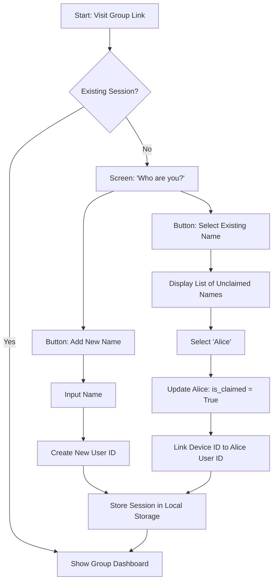

# Feature Specifications: Potluck

This document defines the logic and state transitions for complex features within the Potluck application.

---

## 1. Feature: Placeholder Profiles & "Claiming" Logic
**Problem:** In Splitwise, an organizer cannot assign an expense to someone who hasn't downloaded the app or created an account yet.
**Solution:** Allow organizers to create "Placeholder" names that represent real people. These entities can be "claimed" later by invitees.

### Logic Flow & State Transitions
1. **Creation (Organizer):** - Organizer creates a group.
   - Organizer adds names (e.g., "Alice", "Bob") without emails/phones.
   - System generates a `user_id` and sets `is_claimed: false` for each.
2. **Invitation:** - Organizer shares a unique group URL (e.g., `swiftsplit.io/g/uuid-123`).
3. **Joining (Invitee):**
   - New user visits the URL.
   - System checks Local Storage for an existing `session_token` for this group.
   - If none found, UI displays: "Who are you?" with two options:
     - **Option A:** "I am [List of Unclaimed Names]"
     - **Option B:** "I'm new (Add my name)"
4. **Claiming:**
   - If User selects "Alice," the system updates `is_claimed: true`.
   - The user’s current Browser `device_id` is linked to the `user_id` for "Alice."
   - All historical expenses previously assigned to "Alice" are now visible and editable by this user.

---

## 2. Feature: Split Logic & State Machine

**Core Principles**
* **Integer Arithmetic:** All calculations occur in the smallest currency unit (cents) to prevent floating-point processing errors.
* **Zero-Friction Default:** New expenses default to an equal split among all selected group members.

**State Definitions**
* **Unlocked (Auto-Calculated):** The user's split amount is dynamically calculated by the system. Displayed in dark grey text to indicate automation.
* **Locked (Manual Override):** The user's split amount is manually defined via Exact Amount or Percentage input. Displayed in solid black text.

**The Recalculation Engine**
* **Trigger:** The calculation engine fires after a user is done modifying an input value- so that means after they tap or click out of the number input box when creating a split.
* **Deduction:** The system sums all **Locked** amounts and subtracts this value from the Total Expense.
* **Distribution:** The remaining balance is divided equally among all **Unlocked** users using a floor calculation (`Math.floor(remainingBalance / unlockedUsersCount)`).
* **Penny Reconciliation:** The division remainder (the leftover pennies) is distributed sequentially—one cent at a time—to the top users in the **Unlocked** array until the mathematical sum perfectly matches the Total Expense.

**User Interactions**
* **Locking:** Typing a value into a user's input field and then clicking out transitions their state from Unlocked to Locked.
* **Unlocking:** Clearing the input field (leaving it blank) instantly transitions the user back to Unlocked, automatically restoring their dynamically calculated share.

**Validation & Error Handling**
* **Over-Allocation:** An impossible mathematical state occurs if the sum of Locked inputs strictly exceeds the Total Expense.
* **UI Feedback:** When over-allocated, the bottom validation banner renders in red and displays the negative remainder (e.g., "-$10.00 Over Allocated").
* **Submission Lock:** The confirmation button is dynamically disabled to prevent corrupted database insertions until the mathematical sum is corrected.